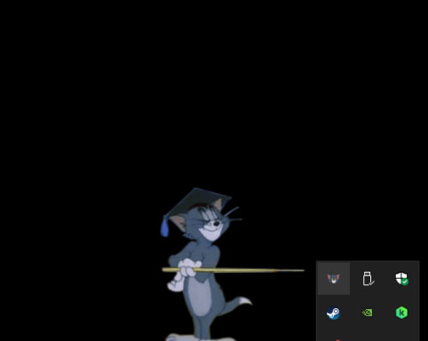
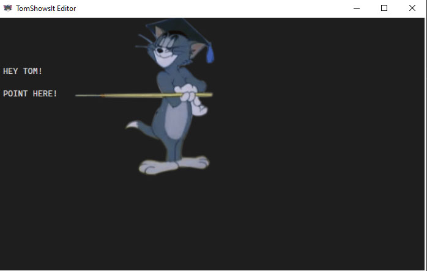

<h1 align="center">
  
   
  Tom Shows It
</h1>
<h4 align="center">Your friends don't know where it is? Tom shows it!</h4>

## How to install
- Go to the 'releases' section and download the latest version.
- Follow the installer instructions and that's it!

## How to use
- Open your "TomShowsIt" application.
- A tray icon will show up like the following

Note: You can right click this icon to exit the application
- Press Windows + Shift + Tab to take a snippet of your screen. Click and drag your mouse to select the area of the snippet.
- The "TomShowsIt Editor" window will show up. You can `Right-Click` to set your Tom pointing from the right, `Left-Click` to set it pointing from the left, `ESC` to leave and `ENTER` to save the image to the clipboard.

